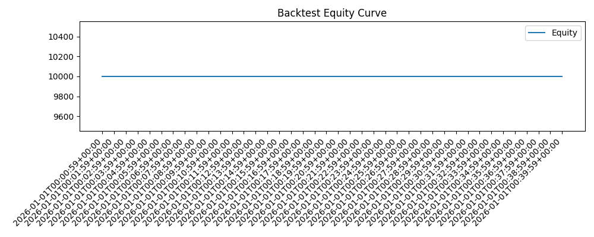
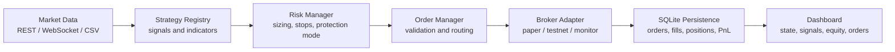

# QuantDesk

Event-driven crypto strategy research sandbox with backtesting, paper trading, risk control, SQLite persistence, and dashboard monitoring.

> Research and learning only. This project is not investment advice. Live trading is disabled by default.



## Highlights

- Event-driven runtime for strategy research and paper trading
- REST/WebSocket market data ingestion for Binance Spot
- Strategy registry with EMA trend and RSI/Bollinger mean-reversion baselines
- Backtesting engine with return, drawdown, win-rate, Sharpe, and trade-level reports
- Risk manager with position sizing, daily-loss stop, consecutive-loss pause, and protection mode
- SQLite persistence for candles, orders, fills, positions, PnL, risk events, and signals
- Freqtrade-style CLI compatibility: `trade`, `backtesting`, `webserver`, `show-config`, `list-strategies`
- Unit and integration tests for core trading flow, risk rules, data clients, order validation, strategies, and dashboard logic

## Architecture



## Project Structure

```text
app/           CLI, runtime, engine, dashboard, alerts
backtest/      backtesting engine, broker, metrics, reports
config/        system and Freqtrade-compatible configs
data/          market data clients, SQLite repositories, cache
execution/     broker adapters, order manager, validators
risk/          position sizing, risk rules, protection mode
strategies/    strategy base class, indicators, example strategies
tests/         unit and integration tests
scripts/       local run helpers
```

## Quick Start

```bash
python -m venv .venv
source .venv/bin/activate
pip install -r requirements.txt
cp .env.example .env
```

List available strategies:

```bash
python main.py list-strategies
```

Run a sample backtest:

```bash
python main.py backtesting -c config/freqtrade_compat.json --csv tests/fixtures/btcusdt_1m_sample.csv
```

Start paper trading with the dashboard:

```bash
python main.py trade -c config/freqtrade_compat.json --dry-run --dashboard both
```

Start read-only market monitoring:

```bash
python main.py trade -c config/freqtrade_compat.json --monitor --dashboard both
```

## Testing

```bash
pytest
```

The test suite covers:

- strategy registry and indicator behavior
- risk rules and position sizing
- order validation and paper broker behavior
- REST/market data client behavior
- paper-engine integration flow
- dashboard data formatting

## Safety Notes

- Secrets are loaded from `.env` only and are excluded from version control.
- Default modes are `paper`, `testnet`, and read-only `monitor`.
- Live trading is intentionally disabled in this public research version.
- No profitability claim is made by this repository.

